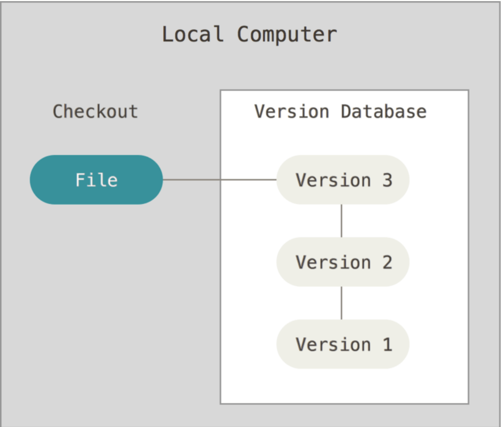
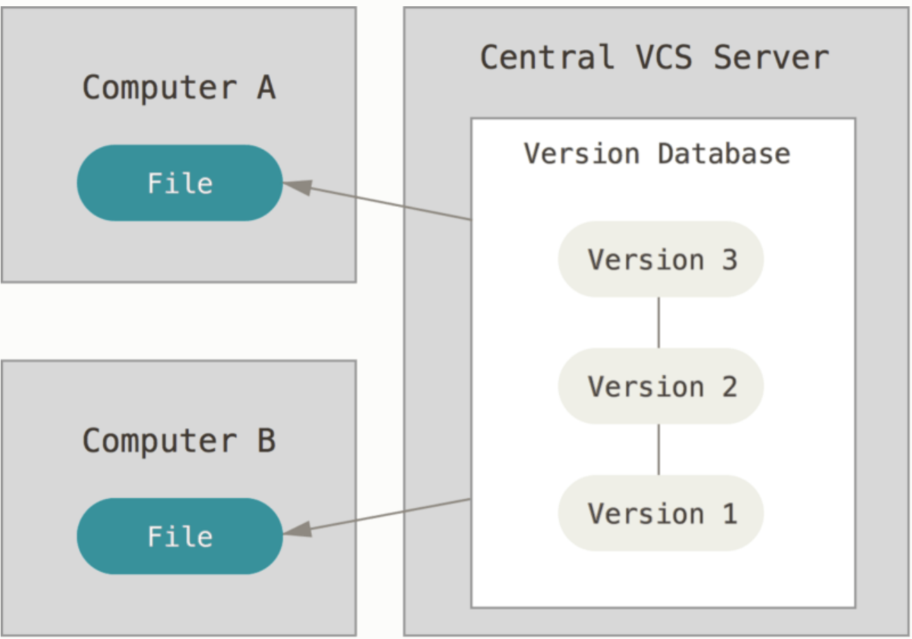
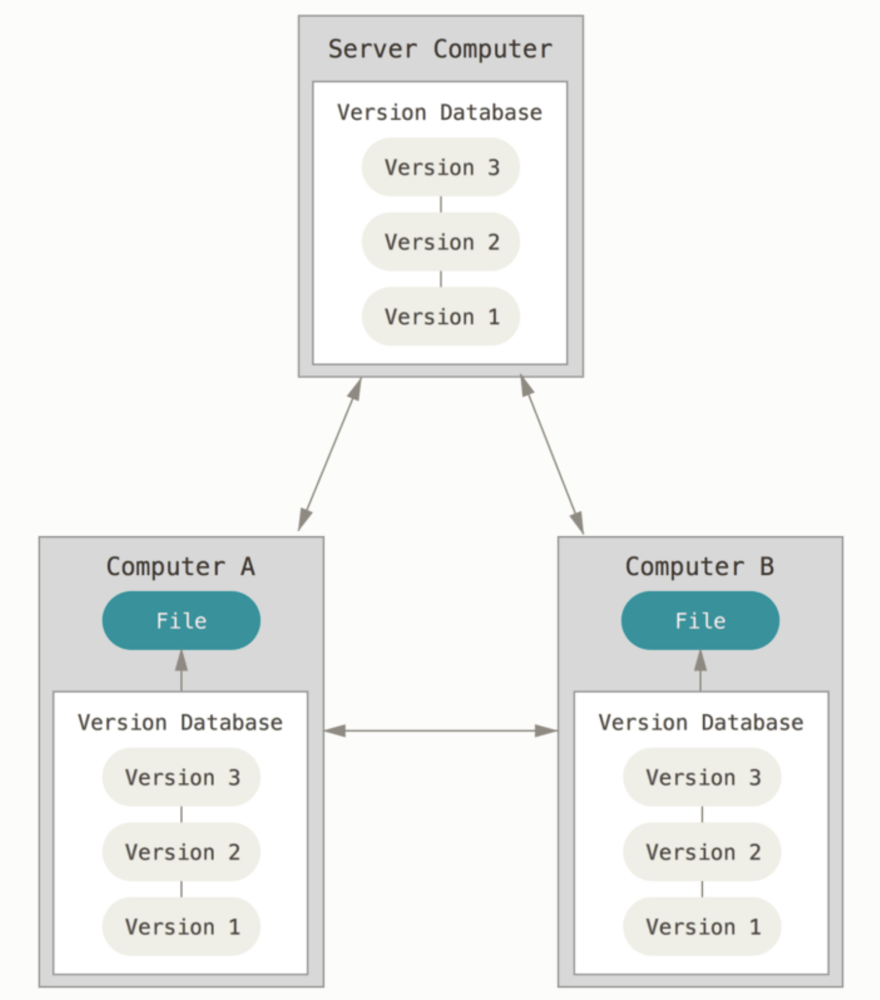
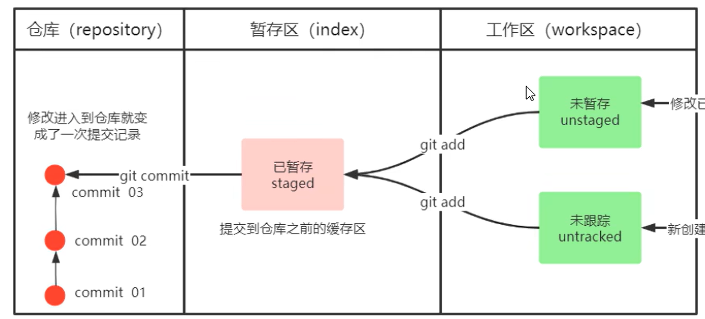
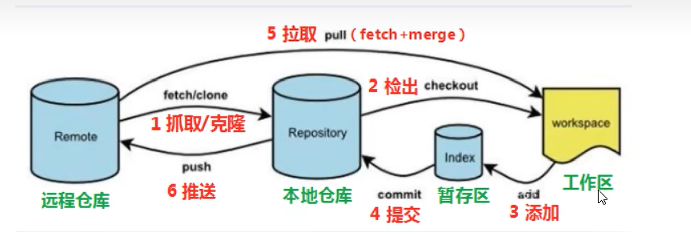
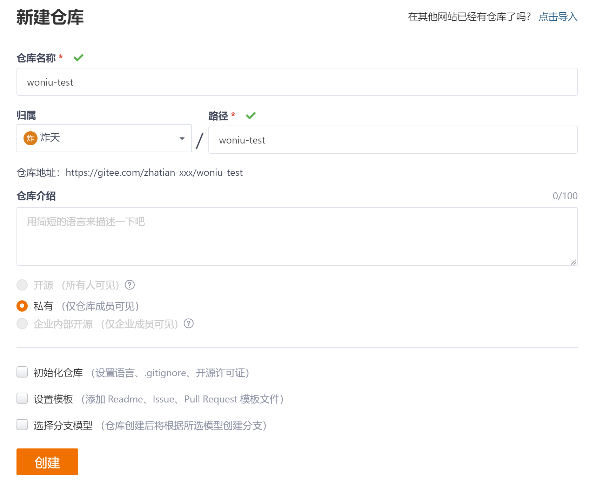

# Git

## 课程目标

Git简介【了解】

使用Git管理文件版本<font color=red>【重点】</font>

远程仓库使用【掌握】

分支管理<font color=red>【重点】</font>

远程仓库【掌握】

## 一、Git简介

### 1、版本控制系统简介

#### 1.1、版本控制前生今世

版本控制系统Version Control Systems，简称 VCS是将『**什么时候、谁、对什么文件做了怎样的修改**』这样的信息以版本的形式保存并进行管理的系统。简单来说，版本控制系统会去记录它所管理的文件的『**历史版本**』。

- ##### 本地版本控制系统

  本地版本控制系统，大多都是采用某种简单的数据库来记录文件的历次更新差异。但是并不能满足不能团队，在不同系统上协同工作。于是，集中化的版本控制系统诞生




- **集中化的版本控制系统**

  每个人都可以在一定程度上看到项目中的其他人正在做些什么。 而管理员也可以轻松掌控每个开发者的权限，并且管理一个 CVCS 要远比在各个客户端上维护本地数据库来得轻松容易。但是缺点也显然易见，若中央服务器的单点故障。 如果宕机一小时，那么在这一小时内，谁都无法提交更新，也就无法协同工作。于是分布式版本控制系统面世了



- **分布式版本控制系统**

  在这类系统中，像 Git、Mercurial、Bazaar 以及 Darcs 等，客户端并不只提取最新版本的文件快照， 而是把代码仓库完整地镜像下来，包括完整的历史记录。 这么一来，任何一处协同工作用的服务器发生故障，事后都可以用任何一个镜像出来的本地仓库恢复。 因为每一次的克隆操作，实际上都是一次对代码仓库的完整备份。

  

  

Git 并非唯一的版本控制系统，它的前辈是 Subversion 。2014 年 Git 的市场占有率首次超过 Subversion ，成为主流。

Git 相较于 Subversion 的先进之处在于：

1. Subversion 中的版本信息仅存在于中央仓库，而 Git 中所有的本地库中都有完整的历史版本信息。

2. Subversion 中的 “分支” 很重，创建分支、删除分支、合并分支等分支相关操作很慢，而 Git 中的分支很轻，分支操作是 Git 的特性

   

#### 1.2、 Git的安装

​      最早Git是在Linux上开发的，很长一段时间内，Git也只能在Linux和Unix系统上跑。不过，慢慢地有人把它移植到了Windows上。现在，Git可以在Linux、Unix、Mac和Windows这几大平台上正常运行了。由于开发机大多数情况都是windows，所以本教程只讲解windows下的git的安装及使用

##### a、安装git

- 下载git

  官方下载地址：<https://git-scm.com/download>

​      淘宝下载地址：https://npm.taobao.org/mirrors/git-for-windows/


- 安装git服务端

  

  ​	图形界面如下:


##### b、Git 的配置

在使用 git 之前需要使用 **config** 命令配置下用户名和用户邮箱：

```ini
git config --global user.name "zhangsan"
git config --global user.email "zh"
git config --global push.default simple
git config --global core.editor notepad
```

这些信息写到全局配置文件通常在【C:\Users\Administrator\.gitconfig】，Administrator不同电脑可能有所区别，重申一遍，你只需要做一次这个设置。如果你传递了 --global 选项，因为Git将总是会使用该信息来处理你在系统中所做的一切操作。如果你希望在一个特定的项目中使用不同的名称或e-mail地址，你可以在该项目中运行该命令而不要--global选项

在使用 git 之前创建 SSH Key，未来会使用到：

```ini
ssh-keygen -t rsa -b 4096 -C "备注"

一路回车

cat ~/.ssh/id_rsa.pub
```

## 二，本地仓库



git init 创建本地仓库

git add 从工作区提交到暂存区

```ini
git add stu.java
git add .  -- 提交所有文件
```

git commit 从暂存区提交到本地仓库

```ini
git commit -m "提交注释"
```

```ini
git status --查询文件状态
git log    -- 查看文件日志
git reset  --hard  commitID  --版本切换
git reflog --查看操作记录
```


## 二、GIT分支操作

### 1、关于分支

版本的提交不可能『依次进行，以便形成一条直线型的提交历史记录』，原因有二：

- 并行式开发：有两个以上的开发者在对同一个项目进行并行式开发。

```ini
版本库 1            版本库2
A <--- B <--- C     A <--- B <--- D

         C
        /
A <--- B  
        \
         D
```

- 修复旧版本中的 bug：一方面要修复旧版本中的 bug，而与此同时又要创建和发布新的版本。

```ini
前期
A <--- B <--- C <--- D

修复 bug 之后
         C <--- D
        /
A <--- B  
        \
         E
```

分支可以看作是开发过程当中的并行线，我们可以把提交图想象成游泳池中的泳道：

```ini
         E              release
        /
A <--- B <--- C <--- D  master
               \
                F       test
```

在一个 Git 版本库中，总是唯一存在着一个『**活动分支**』（也叫『**当前分支**』）。我们可以用 **branch** 命令（不带选项）来列出所有的分支。Git 会用星号（*）凸显出当前活动分支。


###  2. 分支基本操作

#### a、**查看分支**

通过 **git branch** 可以看到 Git 仓库的所有分支。

当执行 git init 指令的时候，Git 就会自动产生一个名为 **master** 的分支：主分支。主分支是默认的、初始的。

#### b、**创建分支**

创建新的分支，也是使用 **git branch** 命令。

```ini
git branch 新分支名 [从当前分支的 Commit]
```

如果省略 Commit，那么就是从当前分支的 HEAD 分化出新分支。


#### c、**切换分支**

建立分支后，可以通过 **git checkout** 命令来切换当前分支：

```ini
git checkout <分支名>
```

有个简单的办法可以创建新分支并切换：

```ini
git checkout -b <新分支名> [Commit节点]
```

（即它总是在当前分支上的）

<font color=red>在图形化界面中，直接双击分支名称即可完成切换</font>

#### d、**删除分支**

删除分支使用：

```ini
git branch -d <被删除分支名>
```

如果在删除一个分支时，自己还未转移到其他分支上，git 会拒绝删除操作。如果坚持要删除的话，则使用 **-D** 选项替换 **-d** 选项。

一般情况下，分支应该合并到另一个分支。如果要删除还未合并的分支，Git 会显示错误信息，并拒绝删除。当然你也通过 **-D** 选项来强制删除


### 3、分支合并

在大多数情况下，项目的分支都会被合并到主（master）分支。合并项目分支需要使用 **git merge** 命令：

```ini
git merge <另一个分支名>
```

一般都是其他分支合并到master分支，先切换到master 分支，在执行git merge  dev01,意思把dev01 代码合并到master上


### 4、冲突

Git 的设计目标之一就是为了能够让开发者之间的分布式协作变得尽可能容易一些。因此从很大程度上来说，merge 命令能自动对分支进行合并，完全不需要用户交互。

当两个分支对于同一个文件做出了不同的操作时，可能会出现冲突，而且此时，Git 无法自动 “帮” 你合并。最常见的冲突情况有 2 种：

- 两个分支对于同一个文件的同一个位置做出了修改。那么你在合并这两个分支时，Git 无法自己决定 “合并后保留的是哪个分支上的内容（而废弃另一个），亦或者是两个分支上的都要保留” ？这种情况，就需要人来裁决。


- 一个分支对一个文件执行了删除操作，而另一个分支上这个文件还在，仅仅只是内容有变动。那么你在合并这两个分支时，Git 无法自己决定 “合并后这个文件到底是应该删除，还是留着” ？这种情况也需要人来裁决。

补充一点，并非对于同一个文件的修改，都会造成冲突。比如，如果两个分支是对同一个文件的不同位置做出了修改（注意和上述第一种情况的区别），Git 自己也会自动合并：合并后的内容会同时采纳两个分支上的操作。

当 Git 遇到了自身无法解决的冲突时，就会显示以下错误信息。

```ini
$ git merge a-branch

Auto-merging foo.txt
CONFLICT (content): Merge conflict in foo.txt
Automatic merge failed; fix conflicts and then commit the result.
```

此时，如果执行 **git status** 命令，会看到 git 提醒你，它无法完成自动合并，需要你手动进行编辑，并且要求你在编辑之后，执行 **git commit** 。

```ini
$ git status

On branch master
You have unmerged paths.
  (fix conflicts and run "git commit")

Unmerged paths:
  (use "git add <file>..." to mark resolution)
 
both modified:   foo.txt
 
no changes added to commit (use "git add" and/or "git commit -a")
```

冲突标志通常会描述两组修改。首先这些被修改的行在当前分支（HEAD）中的内容。接下来又列出了他们在另外一个分支的内容，例如：

```ini
第一次修改
第二次修改
```

手动解决完冲突以后，运行 **git add** 命令把相关文件添加到暂存区。继续执行 **git merge --continue** 命令编辑新生成的提交的 log 信息。然后 merge 完成。


## 四、远程仓库



通常我们并不常亲自建立远程仓库，而是委托给『第三方』。

常见的操作是，先在第三方上创建『远程 Git 文档库』，然后复制（Clone）出一个『本地 Git 文档库』

### 1、在托管网站上创建远程仓库

常见的代码托管仓库有：

- 国外：github、gitlib
- 国内：gitee、Coding

在托管网站上创建项目后，通常项目目录下是空的，可以通过以下 2 种途径初始化该项目：

创建远程仓库




远程仓库创建成功后需要配置自己生成的密钥【了解】

```ini
生成密钥
ssh-keygen -t rsa -b 4096 -C "备注"  //一路回车

cat ~/.ssh/id_rsa.pub               //查看密钥然后复制到gitee上，如下
```


### 2、克隆(拉取)远程仓库至本地

```ini
git clone <远程文档库的路径> <本地文档库的文件夹名称>
```

更具体的的格式为：

```ini
git clone <http://Web服务器地址/远程文档库路径> <本地文档库名称>
```


### 3、推送本地仓库内容到远程仓库

- 当我们完成对本地文档库的修改，可以将这些修改『**推送**』到远程 Git 仓库：

  如果是第一次推送一个工程到远程仓库需要连接远程仓库

  ~~~shell
  git remote add origin 远程仓库地址
  例如：
  git remote add orign https://gitee.com/xiaokongming/three.git
  ~~~

  然后通过 git push 命令把本地分支代码推送到远程仓库上

  ~~~shell
git pull --rebase origin master //同步远程的数据
  
  git push origin [分支名称]
  如：
  git push origin master
  ~~~
  
  代码从远程同步到本地后，对文件进行修改后需要同步到远程仓库，需提交到本地仓库后，通过 git push 命令推到远程仓库

  <font color=red>注意：同步之前一定要git pull 保持和远程代码版本一致</font>

  如：在本地修改一个文件，推送到远程仓库上
  
  ~~~shell
git pull --rebase origin master //同步远程的数据
  git add  "add.txt"   #提交到本地暂存区
  git commit -m "注释"
  git push origin master 
  ~~~


### 4、添加仓库开发者

由于gitee上的仓库为私有的，只有自己才能对远程仓库进行操作，如果团队中的其他成员需要对该远程仓库进行操作，必须将团队成员的gitee帐号添加到仓库中。


配置好后团队的其他成员就可以使用到该仓库


### 5、推送冲突

如果远程分支并非你一个人独有，那么很有可能由于别人的提交，导致远程分支向前演进，从而导致 push 失败。此时需要『**三步合并法**』解决冲突问题。

1. 从远程 Git 文档库取回当前所在分支的最新数据。
2. 把远程 Git 文档库的分支合并到本地 Git 的分支。这一步可能会出现冲突。解决冲突，合并代码。
3. `add-commit-push` 三联，提交并推送本地数据至远程 Git 文档库。

**git pull** 命令可以完成前两部操作。它等价于：先执行 **git fetch**，再执行 **git rebase origin/master** 。


### 6、fetch 和 pull

如果你有一个远程 Git 分支，比如在 GitHub 上的分支，当远程分支上包含当前分支没有的提交时，可以使用取回。

比如，当合并了另一个分支或你的同事推送了一个快速修复时。

​	通过在这个远程分支上执行 `git fetch` ，我们就可在本地获取这些修改。这不会以任何方式影响你的本地分支：**fetch 只是单纯地下载新的数据而已** 。现在我们可以看到自上次推送以来的所有修改了。这些新数据也已经在本地了，我们可以决定用这些新数据做什么了。

​	尽管 git fetch 可用于获取某个分支的远程信息，但我们也可以执行 `git pull` 。`git pull` 实际上是两个命令合成了一个：`git fetch` + `git merge` 。当我们从来源拉取修改时，我们首先是像 `git fetch` 那样取回所有数据，然后最新的修改会自动合并到本地分支中。我们现在与远程分支完美同步了，并且也有了所有最新的修改
